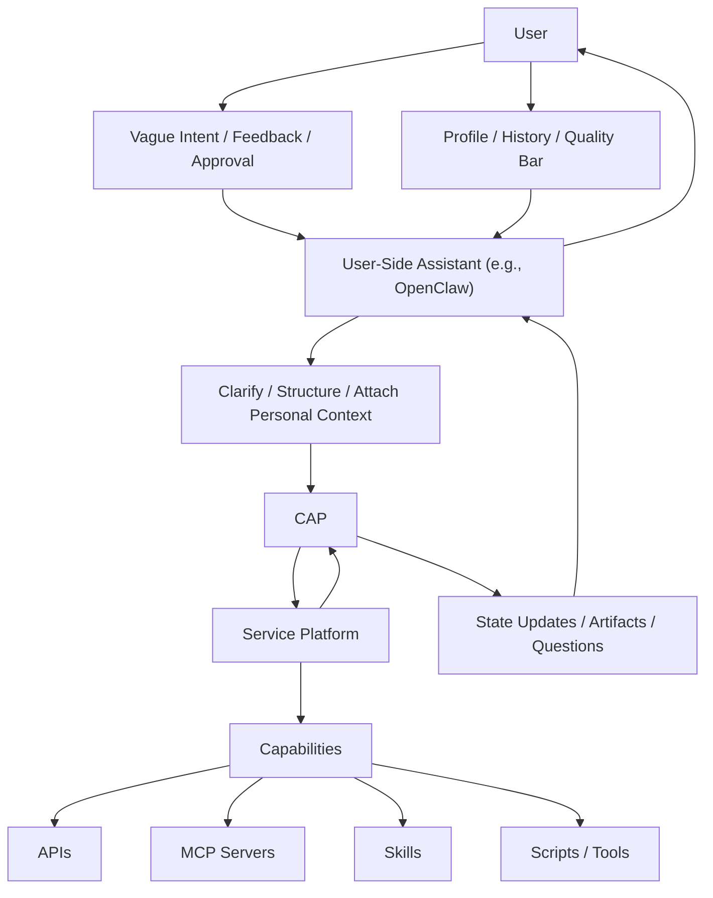
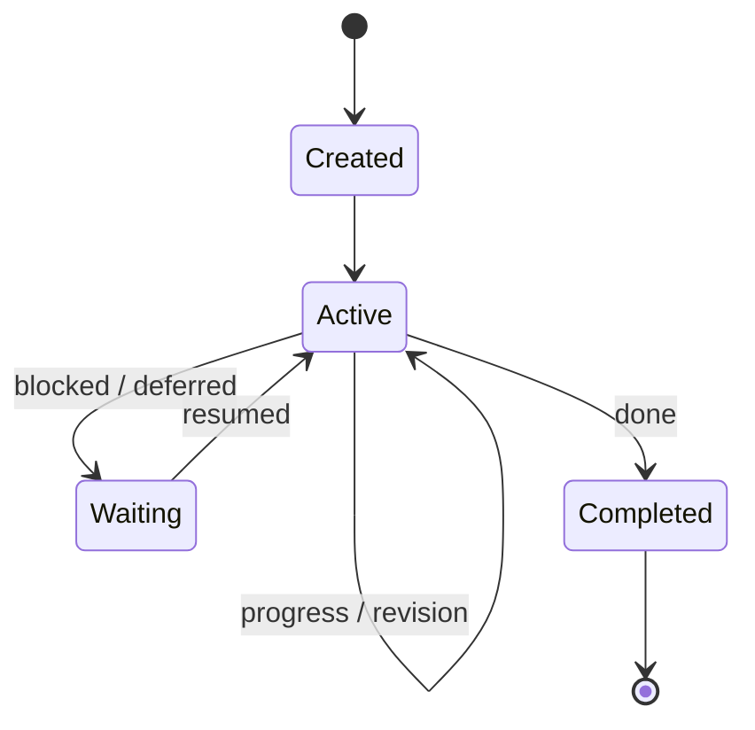
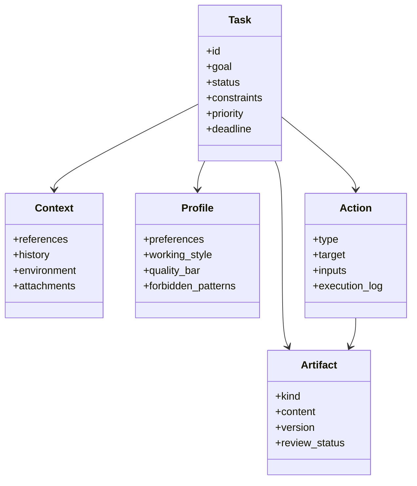

<h1 align="center">Claw Application Protocol (CAP)</h1>

<p align="center">An open protocol draft for task-native AI applications.</p>

<p align="center">
  <em>People should act like bosses, not get trapped in the anxiety of endless configuration.</em><br>
  <em>Users should stay at the level of intent. Systems should absorb the churn below.</em>
</p>

<p align="center"><a href="./README.zh-CN.md">中文说明</a></p>

CAP is an open initiative and protocol draft for **task-native AI applications**.

- AI-derived tools, models, runtimes, and integrations are changing faster than most users can track
- the user should not have to learn that moving stack directly
- the user entry point should stay at the most primitive interaction layer: goal, correction, approval, and preference
- the changing execution layer below should be automatically configured around the task

Its starting point is simple:

- the core unit is not a feature call, but a **task object**
- AI is not only a responder or tool caller, but a **persistent task participant**
- APIs, MCP servers, skills, and scripts remain important, but they are **runtime capabilities**
- the real product capability is whether the system can **keep moving a task forward over time**

In one sentence:

> Traditional AI integration asks: "how can the system call a capability?"  
> CAP asks: "how can a system continuously advance a task?"

## Overview

Current software layers solve different problems:

- **API** exposes application features
- **MCP** standardizes capability discovery and invocation for models and agents
- **Skill** packages reusable task fragments

These layers are useful, but they still do not define the missing runtime center for many real AI applications:

- evolving state
- user-specific expectations
- execution history
- intermediate artifacts
- review and revision loops
- pause and resume continuity

CAP is a proposal for that missing layer.

## What CAP Is

CAP is a minimal protocol layer for expressing and advancing a persistent task across system boundaries.

It is meant to define:

- a **task contract** that survives beyond one request-response turn
- a small set of **core objects** around that task
- minimal **runtime semantics** for progress, waiting, resuming, and completion
- a clean boundary between **user-side context** and **execution-side systems**

## What CAP Is Not

CAP does not try to:

- replace APIs
- replace MCP
- replace skills
- prescribe one agent framework
- force one memory or storage architecture
- standardize every internal reasoning or planning step

CAP sits above capability layers and below product-specific implementation details.

## Architectural Position

At a high level, CAP sits between a user-side assistant context, for example **OpenClaw**, and an execution-side service platform.



This separation is the main claim:

- the **user** provides goals, feedback, and acceptance criteria
- the **user-side assistant** such as **OpenClaw** accumulates profile, history, and quality standards over time
- the **user-side assistant** turns vague intent into a clearer task shape before handoff
- **CAP** expresses the task as a durable contract
- the **service platform** executes against that contract
- **APIs, MCP servers, skills, and scripts** remain capability layers below execution

In this repository, **OpenClaw** is one motivating example of the user-side assistant role.
It is not a required part of CAP itself.
The name **Claw Application Protocol** intentionally keeps that origin visible so the protocol remains legible as an OpenClaw-originated initiative, even though it is not limited to OpenClaw deployments.

More architectural discussion lives in [`docs/architecture.md`](./docs/architecture.md).

## Why This Split Matters

CAP is based on the view that for many real tasks, the best default is not to make the user-side assistant directly complete everything through raw API, MCP, and skill composition.

That split matters because:

- users should not have to maintain a growing execution stack for every kind of work
- service platforms often have stronger tools, workflows, observability, and recovery
- specialized execution is often cheaper and more reliable when optimized centrally
- the user-side assistant is better placed to clarify intent and judge whether the result meets the user's bar

Another reason is interface stability.
If the AI stack keeps changing underneath, the user should not need a new interaction model every few weeks.
CAP makes it easier to keep the user-facing entry point stable while letting the execution side reconfigure models, tools, prompts, skills, and workflows automatically around the task.

This is an architectural argument, not an absolute rule.
Simple tasks can still be completed directly on the user side.

## Runtime Model

CAP keeps runtime semantics intentionally small.



A CAP-compatible system only needs a shared understanding that:

- a task can be created
- a task can progress through actions and revisions
- a task can wait and later resume
- a task can complete with preserved state and artifacts

Planning, reasoning, and orchestration internals can remain implementation-specific.

## Core Objects

CAP currently centers on five objects:

- **Task**: the persistent unit being advanced
- **Context**: materials, references, history, and environment
- **Profile**: user preferences, working style, and quality bar
- **Action**: an executed or proposed step
- **Artifact**: any intermediate or final output



## Design Principles

- **Task-first**: the task is a first-class runtime object
- **Persistent participation**: AI remains inside the work over time
- **Capability-agnostic**: APIs, MCP servers, skills, and scripts can coexist under one task runtime
- **Stateful execution**: meaningful steps should move visible task state
- **Reviewable outputs**: outputs should be inspectable, revisable, and versioned
- **User-shaped quality**: "done" depends on a particular user's standards, not generic correctness alone

## Example

A research-writing assistant built on CAP would not simply:

- call search
- summarize sources
- generate a draft

It would instead:

1. create a task object for the writing goal
2. load user profile information such as preferred structure and evidence bar
3. plan and execute retrieval actions
4. attach notes and citations as artifacts
5. review whether evidence is sufficient
6. identify missing sections and continue the task
7. revise the draft until it meets the user's standard

That is the shift from capability use to task runtime.

## Common Questions

### Is CAP trying to replace APIs, MCP, or skills?

No.

CAP assumes those layers remain useful.
The claim is only that they do not define task continuity by themselves.

### Is CAP a full agent framework?

No.

CAP does not prescribe one planner, one memory model, one prompting method, or one review loop.
It defines the task boundary above those choices.

### Does CAP require OpenClaw?

No.

OpenClaw is one motivating environment for CAP, not a mandatory dependency.
Any user-side assistant or client context could occupy that role.
CAP keeps the **Claw** name intentionally because the protocol is being proposed from the OpenClaw context and should remain associated with that origin.

### Does CAP mean every important task must be remote or service-hosted?

No.

CAP is about separation of responsibilities, not mandatory deployment topology.
A service platform may still run close to the user if the architecture supports the same task boundary.

### Can CAP help shield users from fast-moving AI tooling?

Yes, that is one of the motivations.

CAP does not solve this by itself as a wire format alone.
It helps by supporting an architecture where:

- the user interacts through stable task-level inputs such as goals, corrections, approvals, and preferences
- the assistant and service platform handle tool selection, model routing, and environment setup automatically
- changing capabilities can be swapped underneath without rewriting the user interaction model each time

## Scope And Status

This repository is currently an **open initiative with a minimal protocol draft**.

The first milestone is intentionally small:

- define the problem clearly
- define the minimum object model
- define the runtime lifecycle
- explain how CAP relates to APIs, MCP, and skills
- provide concrete examples of task-native applications

If the framing proves useful in practice, CAP can evolve into:

1. a clearer conceptual model
2. a minimal interoperable protocol
3. a broader ecosystem convention for task-native AI applications

## Repository

```text
CAP/
  README.md
  README.zh-CN.md
  docs/
  spec/
  schemas/
  examples/
```

Current draft documents:

- [`docs/manifesto.md`](./docs/manifesto.md)
- [`docs/architecture.md`](./docs/architecture.md)

The `spec/`, `schemas/`, and `examples/` directories are reserved for the next stage of the draft.

## Contributing

Early contributions are most useful in these areas:

- sharpening the problem statement
- challenging the object model
- proposing minimal wire formats
- testing CAP concepts against real agent products
- mapping CAP onto existing runtimes and assistant systems
