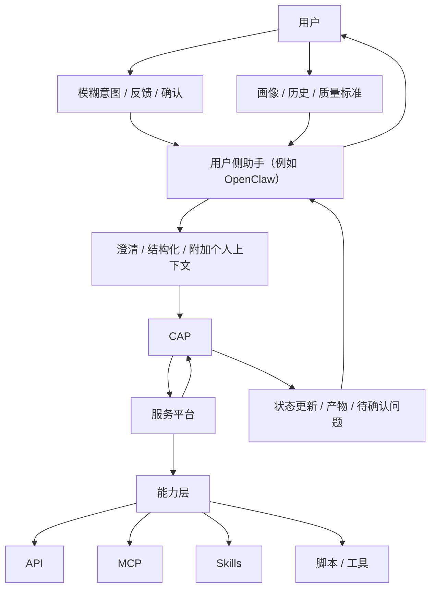
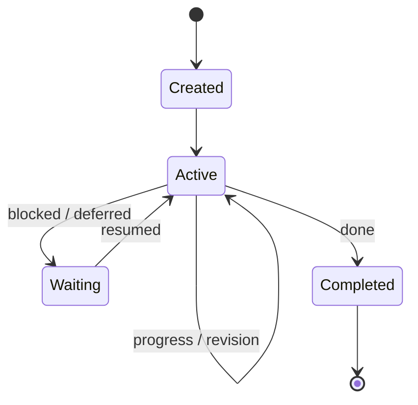
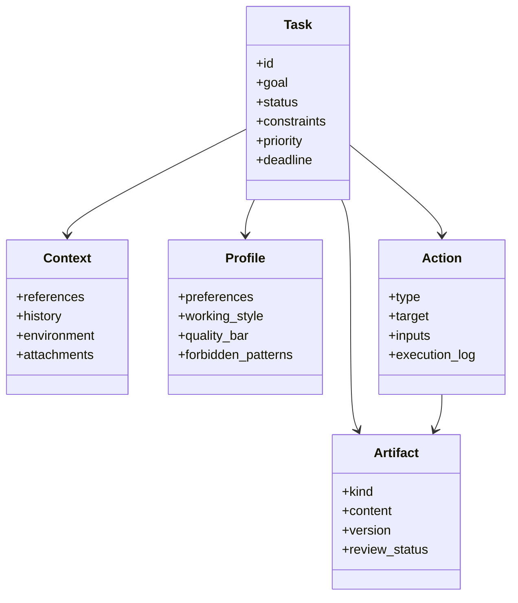

<h1 align="center">Claw Application Protocol (CAP)</h1>

<p align="center">一个面向任务原生 AI 应用的开放协议草案。</p>

<p align="center">
  <em>每个人都应该像老板一样发出目标，而不是陷入没完没了的配置焦虑。</em><br>
  <em>用户应停留在意图层，系统应吸收下方持续变化的复杂性。</em>
</p>

<p align="center"><a href="./README.md">English README</a></p>

CAP 是一个面向 **任务原生 AI 应用** 的开源倡议与协议草案。

- AI 衍生出来的工具、模型、runtime、集成方式变化越来越快
- 用户不应该被迫直接学习这套不断变化的执行栈
- 用户入口应该停留在最原始的交互逻辑上：目标、纠正、确认、偏好
- 而下方持续变化的执行层，应当围绕任务自动完成配置

它的基本出发点很简单：

- 系统的核心单位不再是某个功能调用，而是一个**任务对象**
- AI 不只是响应器或工具调用者，而是任务中的**持续参与者**
- API、MCP、skill、脚本依然重要，但它们属于**运行时能力层**
- 真正的产品能力，是系统能否围绕一个任务**持续推进**

一句话概括：

> 传统 AI 集成关心的是：“系统如何调用某个能力？”  
> CAP 关心的是：“系统如何围绕一个任务持续把事情推进下去？”

## 概览

现有软件层各自解决不同问题：

- **API** 负责暴露应用功能
- **MCP** 负责让模型和 agent 发现并调用能力
- **Skill** 负责封装可复用的任务片段

这些层都很有价值，但它们仍然没有定义许多真实 AI 应用所缺失的运行时中心：

- 持续演化的状态
- 用户特定的预期与标准
- 执行历史
- 中间产物
- 审查与修订循环
- 暂停与恢复后的连续性

CAP 试图补上的，就是这一层。

## CAP 是什么

CAP 是一个最小协议层，用来把一个持续存在的任务表达出来，并让它跨系统边界被推进。

它想定义的是：

- 一个能跨越单轮请求的**任务契约**
- 围绕任务组织起来的一组**核心对象**
- 关于推进、等待、恢复、完成的最小**运行语义**
- **用户侧上下文**与**执行侧系统**之间清晰的边界

## CAP 不是什么

CAP 不试图：

- 替代 API
- 替代 MCP
- 替代 skill
- 绑定某一个 agent framework
- 强制规定某一种 memory 或存储架构
- 标准化所有内部推理或规划细节

CAP 位于能力层之上、产品具体实现细节之下。

## 架构位置

从高层看，CAP 位于用户侧助手上下文（例如 **OpenClaw**）与执行侧服务平台之间。



这里真正想表达的是：

- **用户**提供目标、反馈和验收标准
- **用户侧助手**（例如 **OpenClaw**）会持续沉淀用户画像、历史与质量标准
- **用户侧助手** 会先把模糊意图整理成更清晰的任务表达
- **CAP** 负责把任务表达成可持续存在的契约
- **服务平台** 负责围绕这个契约执行
- **API、MCP、skill、脚本** 依然是执行侧之下的能力层

在这个仓库里，**OpenClaw** 是用户侧助手角色的一个动机性示例。
它并不是 CAP 的必需组成部分。
`Claw Application Protocol` 这个名字也有意保留了这种来源关系，让 CAP 明确表现为一个从 OpenClaw 语境中提出的协议倡议，而不是与之完全切断。

更多架构讨论见 [`docs/architecture.md`](./docs/architecture.md)。

## 为什么这种分层重要

CAP 的一个核心判断是：对很多真实任务，更合理的默认方式，并不是让用户侧助手直接通过原始 API、MCP 和 skill 拼装把一切做完。

这种分层重要，是因为：

- 用户不应该为了各种任务长期维护越来越复杂的执行栈
- 服务平台通常有更强的工具、工作流、观测能力和恢复机制
- 专业执行在中心化优化后，往往更便宜也更稳定
- 用户侧助手更适合理解意图，并判断结果是否真的符合用户标准

还有一个原因是：用户界面应该尽量稳定。
如果底层 AI 栈持续变化，用户不应该每隔几周就重新学习一套新的使用方式。
CAP 的价值之一，就是把用户入口稳定在任务层，同时允许执行侧围绕任务自动重配模型、工具、prompt、skill 和工作流。

这是一种架构判断，不是绝对规则。
简单任务仍然可以直接在用户侧完成。

## 运行模型

CAP 有意把运行语义保持得很小。



一个 CAP 兼容系统只需要对这些事情有共享理解：

- 任务可以被创建
- 任务可以通过动作与修订持续推进
- 任务可以等待并在之后恢复
- 任务可以以保留状态和产物的方式完成

至于 planning、reasoning、orchestration 等内部机制，可以继续由不同实现自行决定。

## 核心对象

CAP 当前围绕五个对象展开：

- **Task**：持续被推进的任务单元
- **Context**：资料、引用、历史与环境
- **Profile**：用户偏好、工作风格与质量标准
- **Action**：已执行或待执行的步骤
- **Artifact**：任何中间或最终产物



## 设计原则

- **任务优先**：任务对象应当是一等运行时实体
- **持续参与**：AI 不是一次性响应，而是持续留在工作过程中
- **能力解耦**：API、MCP、skill、脚本可以共存于同一任务运行模型下
- **状态驱动**：有效步骤应当推动可见的任务状态演化
- **可审查产物**：产物应当可检查、可修订、可版本化
- **用户标准内化**：是否完成，取决于具体用户的标准，而不只是一般正确性

## 例子

一个基于 CAP 的研究写作助手，不会只是：

- 调用搜索
- 摘要资料
- 生成一版草稿

它更像是：

1. 为写作目标创建任务对象
2. 加载用户偏好的结构风格与证据标准
3. 规划并执行检索动作
4. 将笔记和引用作为 artifact 挂回任务
5. 检查当前证据是否足够
6. 识别缺失部分并继续推进任务
7. 持续修订草稿，直到达到用户标准

这就是从“能力调用”转向“任务运行”。

## 常见问题

### CAP 是要替代 API、MCP 或 skill 吗？

不是。

CAP 的前提恰恰是这些层仍然有价值，它的观点只是：这些层本身并不能定义任务连续性。

### CAP 是一个完整的 agent framework 吗？

不是。

CAP 不规定唯一的 planner、memory 模型、prompt 方式或 review loop。
它定义的是这些选择之上的任务边界。

### CAP 必须依赖 OpenClaw 吗？

不是。

OpenClaw 只是 CAP 的一个动机性使用场景，不是强制依赖。
任何能承担用户侧上下文角色的助手或 client 都可以处在这个位置。
CAP 依然保留 `Claw` 这个名字，也是有意为之，因为这个协议本来就是从 OpenClaw 语境中提出，并希望保留这种认知锚点。

### CAP 是否意味着重要任务都必须远程或服务化？

不是。

CAP 关注的是职责分层，不是部署拓扑的强制要求。
只要同样的任务边界成立，执行平台也可以离用户很近。

### CAP 能帮助用户隔离快速变化的 AI 工具体系吗？

可以，这正是它的动机之一。

当然，CAP 不是单靠一个 wire format 就自动解决这个问题。
它的作用在于支持这样一种架构：

- 用户始终通过稳定的任务层输入与系统交互，比如目标、纠正、确认、偏好
- 助手和服务平台自动处理工具选择、模型路由、环境配置
- 底层能力可以持续更换，但用户交互模型不必跟着反复重学

## 范围与状态

这个仓库目前定位为一个**开源倡议 + 最小协议草案**。

第一阶段有意保持克制，只做这些事：

- 把问题定义说清楚
- 定义最小对象模型
- 定义最小运行生命周期
- 说明 CAP 与 API、MCP、skill 的关系
- 提供若干任务原生应用的例子

如果这套 framing 在实践中被证明有价值，CAP 可以逐步演化为：

1. 更清晰的概念模型
2. 最小可互操作协议
3. 面向任务原生 AI 应用的更广泛生态约定

## 仓库结构

```text
CAP/
  README.md
  README.zh-CN.md
  docs/
  spec/
  schemas/
  examples/
```

当前已有的草案文档：

- [`docs/manifesto.md`](./docs/manifesto.md)
- [`docs/architecture.md`](./docs/architecture.md)

`spec/`、`schemas/`、`examples/` 目录为下一阶段草案预留。

## 贡献方向

当前阶段最有价值的贡献包括：

- 打磨问题定义
- 质疑并完善对象模型
- 提出最小可交换格式
- 用真实 agent 产品验证 CAP 的表达能力
- 讨论 CAP 如何映射到现有助手或 runtime 系统
