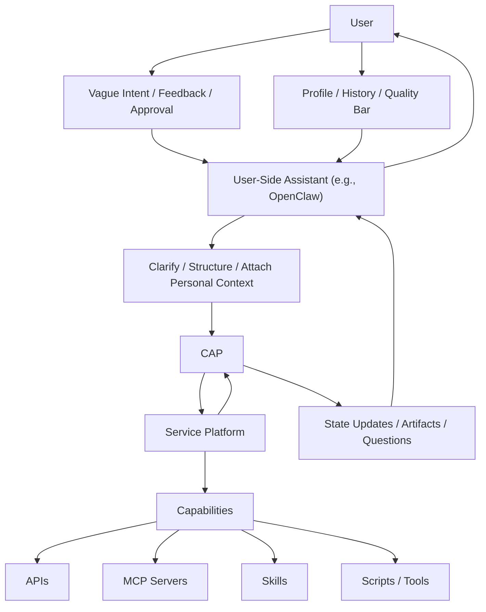
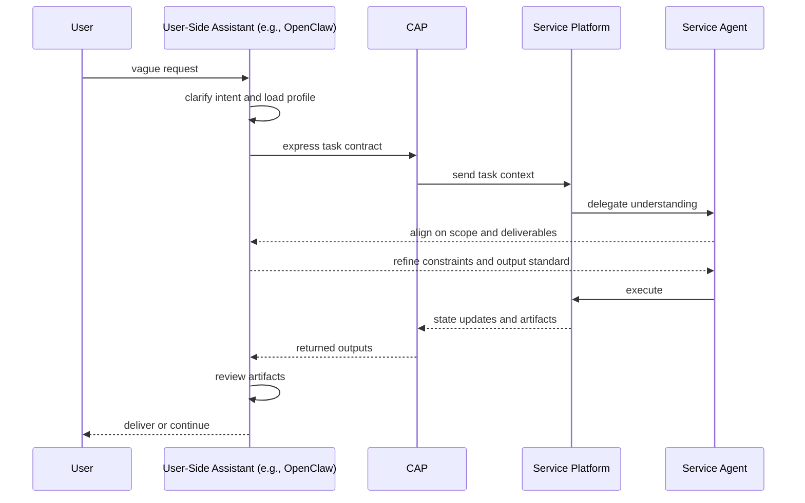
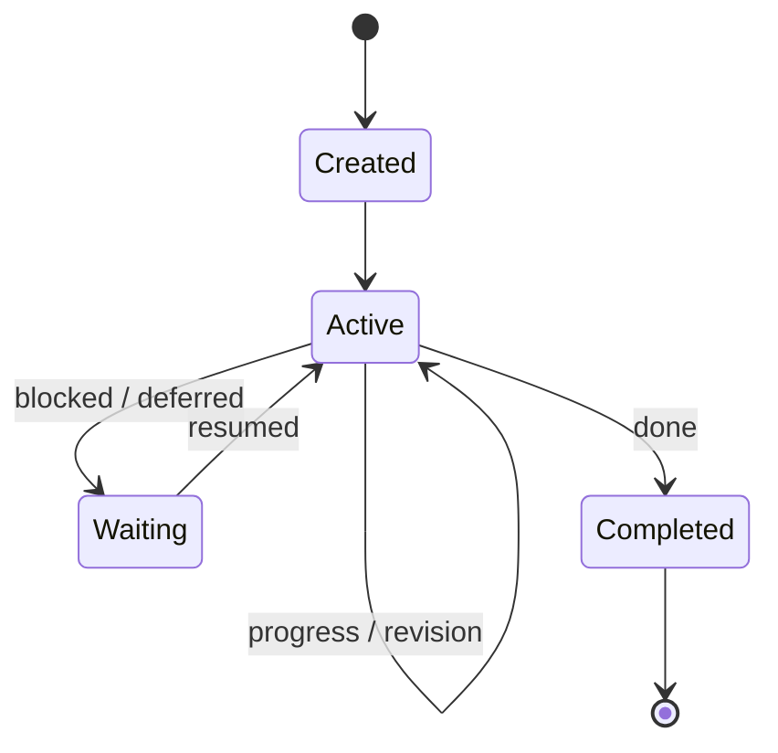
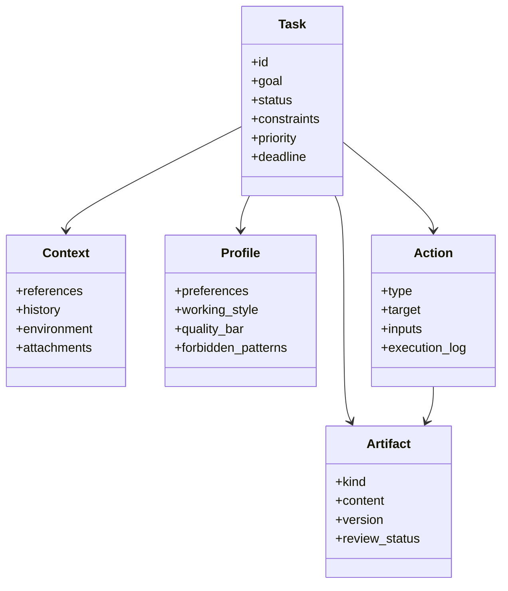

# CAP Architecture

## Purpose

This document describes the architectural position of **Claw Application Protocol (CAP)**.

CAP is not a full agent framework.
It defines the protocol boundary that lets a user-side assistant context, for example **OpenClaw**, and an execution-side service platform collaborate around a persistent task object.

## Core Boundary

The core claim of CAP is:

- the **user** is the source of goals, feedback, and acceptance criteria
- the **user-side assistant**, for example **OpenClaw**, carries user-specific context and clarifies intent
- **CAP** expresses the task as a durable contract
- the **service platform** advances the task through its own execution runtime
- **APIs, MCP servers, skills, and scripts** remain capability layers below the service platform

This matters because it prevents CAP from collapsing into any one adjacent layer:

- not just a tool invocation protocol
- not just a memory format
- not just an agent loop
- not just a product UX concept

CAP exists at the **task contract boundary**.

## OpenClaw And The Name

In this repository, **OpenClaw** is the clearest motivating example of the user-side assistant role.
It is not a mandatory dependency of CAP.

Another assistant or client context could occupy the same position if it can:

- clarify user intent
- carry user-specific standards
- preserve continuity across time
- review whether returned work is actually acceptable

CAP keeps the **Claw** name intentionally.
The protocol is being proposed from the OpenClaw context and should remain associated with that origin, even though it is not limited to OpenClaw deployments.

## Why This Boundary Exists

### 1. The User Entry Point Should Stay Stable

The AI stack is changing faster than most users can reasonably track.
Tools, models, runtimes, prompt patterns, and workflow conventions shift continuously.

If the user is expected to manage those moving parts directly, the system becomes harder to use as it becomes more capable.

The user-facing entry point should stay at the most primitive interaction layer:

- express the goal
- correct the direction
- approve or reject outcomes
- carry long-term preferences

The churn below that layer should be absorbed by the system.

### 2. User-Side Configuration Does Not Scale

If the user-side assistant is expected to complete all tasks through local configuration of MCP servers, skills, APIs, tools, prompts, and environments, the user inherits too much operational complexity.

That creates several problems:

- too many tool and configuration decisions
- too much setup overhead
- constant relearning as the AI ecosystem shifts
- a product that feels powerful in theory but tiring in practice

CAP assumes that configuration burden should move downward into the execution stack, not upward onto the user.

### 3. Delegation Is Usually The Point

In many tasks, the user is acting more like a manager than an operator.

The goal is often not:

- to personally execute every specialized step
- to manually assemble every capability needed for the work

The goal is to assign, coordinate, and keep the work moving.

The user-side assistant is well placed to:

- understand the user's actual need
- clarify success criteria
- route the task to the right execution context
- judge whether the returned work meets the user's bar

That is different from directly owning every execution detail.

### 4. Centralized Execution Is Often Better

A service platform often has stronger execution conditions than the user side:

- broader data sources
- deeper domain-specific configuration
- more complete runtime environments
- specialized validators and workflows
- better observability and recovery mechanisms

It can also often optimize cost and reliability more effectively:

- amortized infrastructure and model usage
- centralized routing and caching
- repeatable evaluation
- versioned workflows
- clearer ownership of failure modes

The result is often lower effective cost, better throughput, and more stable artifacts.

### 5. CAP Separates Personal Alignment From Specialized Execution

The split is useful because the two sides are good at different things:

- the **user-side assistant** is better at understanding the person
- the **service platform** is better at executing the specialized work

CAP connects those strengths without collapsing them into one runtime.

This does not mean the user-side assistant should never execute tasks directly.
Simple tasks can still be handled locally.

The claim is narrower:

- direct execution is sometimes appropriate
- but for many important tasks, the better default is for the assistant to clarify, align, and review while the service platform performs the heavier execution

## Questions And Answers

### Is CAP just another tool protocol, memory format, or agent loop?

No.

Those layers are adjacent, but they answer different questions:

- a tool protocol standardizes capability invocation
- a memory format stores state
- an agent loop defines internal execution behavior
- CAP defines the persistent task contract between user-side context and execution-side runtime

### Does CAP require OpenClaw?

No.

OpenClaw is the motivating environment in this repository, not a requirement for compatible systems.

### Does CAP mean every important task must be remote or service-hosted?

No.

CAP is about separation of responsibilities, not mandatory deployment topology.
The execution platform may still run close to the user as long as the same task boundary exists.

### Can CAP help shield users from fast-moving AI tooling?

Yes, that is one of the motivations.

CAP does not solve this by itself as a wire format alone.
It helps by supporting an architecture where:

- the user interacts through stable task-level inputs
- the assistant and service platform handle tool selection and environment setup automatically
- changing capabilities can be swapped underneath without rewriting the user interaction model each time

## Multi-Turn Coordination

For CAP-aware services, interaction does not need to be limited to a one-shot handoff.
A richer coordination pattern is possible:

1. the user gives an ambiguous or incomplete request
2. the user-side assistant clarifies it into a stronger task candidate
3. the service-side agent and the user-side assistant align on scope and deliverables
4. the service platform executes and returns state updates and artifacts
5. the user-side assistant reviews the result against user expectations
6. the task is either delivered, revised, or kept open

This is a supported interaction mode, not a mandatory requirement of CAP itself.

## Minimal Runtime Semantics

CAP intentionally keeps runtime semantics small.

The protocol only needs a shared understanding that:

- a task can be created
- a task can progress through multiple actions and revisions
- a task can pause and resume
- a task can complete with preserved state and artifacts

Planning, reasoning, review heuristics, and orchestration internals remain implementation-specific.

## Core Object Model

CAP currently centers on five objects:

- **Task**: the persistent unit being advanced
- **Context**: materials, references, history, and environment
- **Profile**: user preferences, style, and quality bar
- **Action**: an executed or proposed step
- **Artifact**: any intermediate or final deliverable

## Interaction Modes

CAP should support at least three interaction modes:

### 1. Direct Execution Mode

The user-side assistant clarifies the task and passes it through CAP to a service platform for execution.
The service platform returns updates and outputs.

### 2. Coordinated Execution Mode

The user-side assistant and the service-side agent align over multiple turns before execution continues.

This is useful when:

- user needs are ambiguous
- deliverables have strong domain or formatting constraints
- the service platform needs more precise acceptance criteria

### 3. Reviewed Delivery Mode

Returned artifacts are checked by the user-side assistant before they are shown to the user or accepted as final.

This is useful when:

- user-specific style matters
- the quality bar is personal rather than generic
- the task involves iterative refinement rather than raw completion

## Cases

### Case 1: Research Writing

The user asks for a literature-backed draft in vague language.

The user-side assistant:

- clarifies topic, depth, citation expectations, and preferred structure
- adds user preferences for tone and evidence bar
- expresses the task through CAP

The service platform:

- retrieves sources
- extracts evidence
- drafts sections
- returns notes, citations, and draft artifacts

The user-side assistant then reviews:

- whether the structure matches the user's preferred style
- whether evidence quality is sufficient
- whether more retrieval is needed before delivery

### Case 2: Coding Task Delegation

The user says, "clean this module up and make it production ready."

The user-side assistant:

- clarifies scope, acceptable refactor size, testing expectations, and risk tolerance
- records coding style and review preferences
- passes the task through CAP

The service platform:

- inspects the codebase
- proposes or executes changes
- runs tests
- returns diffs, logs, and unresolved risks

The user-side assistant reviews:

- whether the output matches the expected level of rigor
- whether remaining risks are acceptable
- whether the task should continue for another revision round

### Case 3: Data Processing Service

The user asks for a data-cleaning result without precise schema requirements.

The user-side assistant:

- clarifies desired output format, tolerable loss, validation rules, and delivery shape
- includes historical preferences for naming, missing-value handling, and reporting

The service platform:

- runs processing steps
- produces cleaned data and processing reports
- records transformations as artifacts

The user-side assistant reviews:

- whether output shape matches the user's expectation
- whether anomalies should trigger another execution round
- whether the result is ready for delivery
